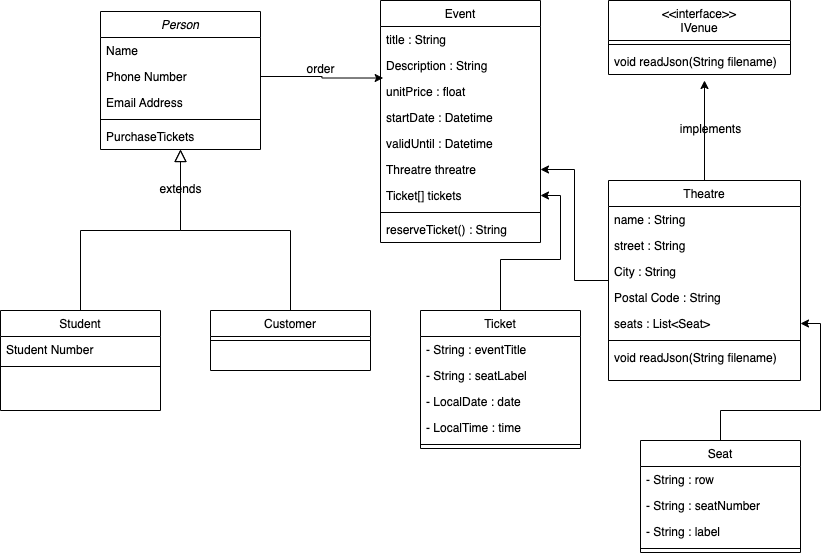

# Movie Theatre Seating Challenge

## Overview
This program is developed to allocate seats to customers purchasing
tickets for a movie theatre.

## UML Diagram

## Key features
1. read theatre information from a json file.
2. read theatre seating plan from a json file.
3. create ticket FIFO queue to keep track the number of available tickets.

## Assumptions
- Write a program that allocates seats based on a random integer “number of seats” between 1 and 3

- Your program should allocate the required number of seats from the available seats starting from seat A1 and filling the auditorium from
left to right, front to back
- All of the seats are available for sale when the program starts
- The program should continue to allocate a random number of seats until it finds there are not enough seats left to complete the request
- Once there are not enough seats available to be allocated then the program can halt

## TDD Approaches
1. test read json file function
2. test theatre property assignment
3. test event class

## future thoughts