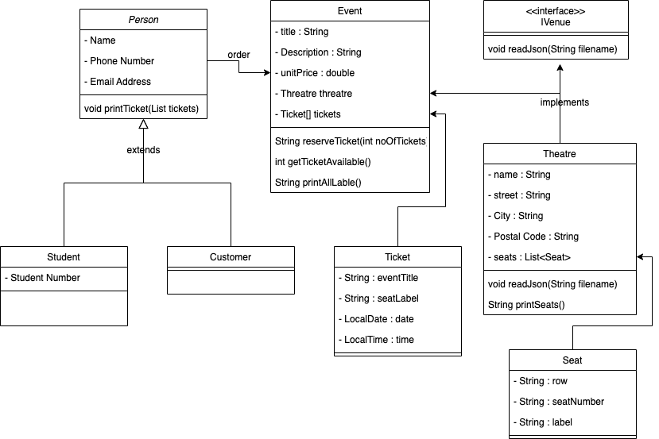

# Movie Theatre Seating Challenge

## Overview
This program is developed to allocate seats to customers purchasing
tickets for a movie theatre.

## UML Diagram


## Key features
1. read theatre information from a json file.
2. read theatre seating plan from a json file.
3. read event information and cost from a json file 
4. create ticket FIFO queue to keep track the number of available tickets. 
5. implement a seat allocation function

## Assumptions
- Write a program that allocates seats based on a random integer “number of seats” between 1 and 3

- Your program should allocate the required number of seats from the available seats starting from seat A1 and filling the auditorium from
left to right, front to back
- All of the seats are available for sale when the program starts
- The program should continue to allocate a random number of seats until it finds there are not enough seats left to complete the request
- Once there are not enough seats available to be allocated then the program can halt

## TDD Approaches
1. test read json file function
2. test theatre property assignment
3. test event class
4. test seat allocation logic

## Sample Test Result
- Run seatAllocationTest
- Input files
  - Event.json
```agsl
{
  "title": "Lion King",
  "date": "1-May-2023",
  "time": "20:30:00",
  "price": "14.0"
}
```
  - Theatre.json
```agsl
{
  "name": "Ray Theatre",
  "street": "5 Theatre Street",
  "city": "Kingston",
  "postalCode": "KT1 9XX",
  "rows": [
    {
      "name": "A",
      "seats": [
        {"name": "1"},
        {"name": "2"},
        {"name": "3"},
        {"name": "4"},
        {"name": "5"}
      ]
    },
    {
      "name": "B",
      "seats": [
        {"name": "1"},
        {"name": "2"},
        {"name": "3"},
        {"name": "4"},
        {"name": "5"}
      ]
    },
    {
      "name": "C",
      "seats": [
        {"name": "1"},
        {"name": "2"},
        {"name": "3"},
        {"name": "4"},
        {"name": "5"}
      ]
    }
  ]
}
```
  - Test cases from csv file "customer name,email"
```agsl
ray1,ray1@gmail.com
ray2,ray2@gmail.com
ray3,ray3@gmail.com
ray4,ray4@gmail.com
ray5,ray5@gmail.com
ray6,ray6@gmail.com
ray7,ray7@gmail.com
ray8,ray8@gmail.com
ray9,ray9@gmail.com
ray10,ray10@gmail.com
```
- Results
```agsl
ray1 bought 2 tickets for £28.00
ray1,Ticket#1,A1,Lion King,2023-05-01
ray1,Ticket#2,A2,Lion King,2023-05-01
ray2 bought 3 tickets for £42.00
ray2,Ticket#1,A3,Lion King,2023-05-01
ray2,Ticket#2,A4,Lion King,2023-05-01
ray2,Ticket#3,A5,Lion King,2023-05-01
ray3 bought 3 tickets for £42.00
ray3,Ticket#1,B1,Lion King,2023-05-01
ray3,Ticket#2,B2,Lion King,2023-05-01
ray3,Ticket#3,B3,Lion King,2023-05-01
ray4 bought 3 tickets for £42.00
ray4,Ticket#1,B4,Lion King,2023-05-01
ray4,Ticket#2,B5,Lion King,2023-05-01
ray4,Ticket#3,C1,Lion King,2023-05-01
ray5 bought 2 tickets for £28.00
ray5,Ticket#1,C2,Lion King,2023-05-01
ray5,Ticket#2,C3,Lion King,2023-05-01
ray6 bought 2 tickets for £28.00
ray6,Ticket#1,C4,Lion King,2023-05-01
ray6,Ticket#2,C5,Lion King,2023-05-01
Theatre is FULL!
ray7 bought 0 ticket
```

## future thoughts
- Person class can be extended by other group of people like student, senior
- Other venues such hall, stadium can implement IVenue interface class
- Movie events management system
- online and offline payment system
- membership system
- Web application interface